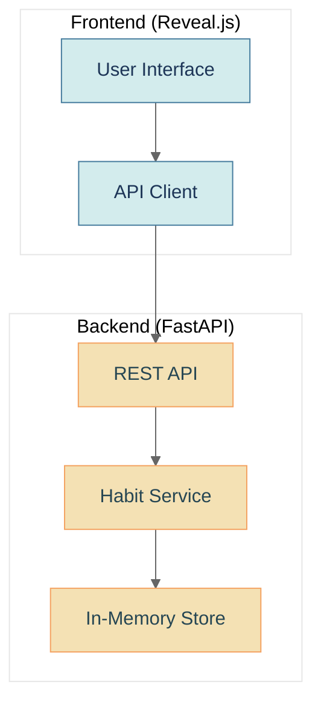

# System Architecture Overview

## High-Level Architecture

## Components
1. **Frontend**: A simple UI built with HTML, CSS, and JavaScript, using Reveal.js for presentation. The frontend communicates with the backend API to retrieve and update habit data.
2. **Backend**: A FastAPI application that provides REST endpoints for managing habits. The backend stores all data in memory, eliminating the need for a database.
3. **In-Memory Store**: A simple data structure that stores habits and their completion status in memory.

## Data Flow
1. User interacts with the UI to create, update, or view habits
2. The frontend sends API requests to the backend
3. The backend processes the requests and updates the in-memory store
4. The backend returns the updated data to the frontend
5. The frontend updates the UI to reflect the changes

## Security Considerations
As this is a simple demo application with in-memory storage, there are minimal security considerations. In a production environment, we would implement:
- User authentication
- Data encryption
- Input validation
- Rate limiting

## Scalability
The current implementation is designed for single-user usage with in-memory storage. For a production application, we would:
- Implement a proper database for persistence
- Add user authentication and multi-user support
- Implement caching for improved performance
- Consider containerization for deployment scalability
