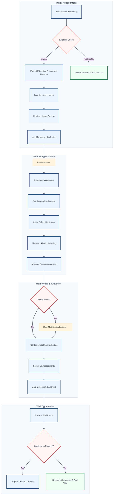

# Clinical Trial Phase 1 Flow

```mermaid
%%{init: {
  'theme': 'base',
  'themeVariables': {
    'fontFamily': 'Arial, sans-serif',
    'fontSize': '14px',
    'primaryTextColor': '#2A2A2A'
  }
}}%%
flowchart TD
    %% Styling Definitions
    classDef process fill:#EBF5FF,stroke:#2C5282,stroke-width:2px,color:#2D3748,font-family:Arial,font-size:14px,padding:10px;
    classDef decision fill:#FFF5F5,stroke:#C53030,stroke-width:2px,color:#2D3748,font-family:Arial,font-size:14px,padding:10px;
    classDef endpoint fill:#F0FFF4,stroke:#2F855A,stroke-width:2px,color:#2D3748,font-family:Arial,font-size:14px,padding:10px;
    classDef subgraphStyle fill:#F7FAFC,stroke:#E2E8F0,stroke-width:2px,color:#4A5568,font-family:Arial,font-size:16px,font-weight:bold;

    %% Initial Patient Interaction
    subgraph Initial["Initial Assessment"]
        A[Initial Patient Screening] --> B{Eligibility Check}
        B -->|Eligible| C[Patient Education & Informed Consent]
        B -->|Not Eligible| D[Record Reason & End Process]
        C --> E[Baseline Assessment]
        E --> F[Medical History Review]
        F --> G[Initial Biomarker Collection]
    end
    
    %% Phase 1 Trial Process
    subgraph Trial["Trial Administration"]
        G --> H[Randomization]
        H --> I[Treatment Assignment]
        I --> J[First Dose Administration]
        J --> K[Initial Safety Monitoring]
        K --> L[Pharmacokinetic Sampling]
        L --> M[Adverse Event Assessment]
    end
    
    %% Follow-up Process
    subgraph Monitoring["Monitoring & Analysis"]
        M --> N{Safety Issues?}
        N -->|Yes| O[Dose Modification Protocol]
        N -->|No| P[Continue Treatment Schedule]
        O --> P
        P --> Q[Follow-up Assessments]
        Q --> R[Data Collection & Analysis]
    end
    
    %% Decision Point
    subgraph Conclusion["Trial Conclusion"]
        R --> S[Phase 1 Trial Report]
        S --> T{Continue to Phase 2?}
        T -->|Yes| U[Prepare Phase 2 Protocol]
        T -->|No| V[Document Learnings & End Trial]
    end
    
    %% Link Styling
    linkStyle default stroke:#4A5568,stroke-width:2px;
    
    %% Apply Classes
    class A,C,E,F,G,I,J,K,L,M,P,Q,R,S,U process;
    class B,N,T decision;
    class D,V endpoint;
    class Initial,Trial,Monitoring,Conclusion subgraphStyle;
```