# Backwards Build Workflow Template

This template provides comprehensive instructions for implementing a backwards build workflow that starts with documentation, creates slides, writes tests, and finally implements the code.

## 1. Documentation Structure (docs/)

Create the following document structure in the `docs/` folder:

### 1.1 Create Documentation Files

```bash
mkdir -p docs/{architecture,state,roadmap}
touch docs/{README.md,vision.md,architecture/system-overview.md,architecture/tech-stack.md,state/current-state.md,roadmap/milestones.md}
```

### 1.2 Documentation Templates

#### docs/README.md
```markdown
# {Project Name} Documentation

## Overview
{Brief project description}

## Quick Links
- [Vision](./vision.md)
- [Architecture](./architecture/system-overview.md)
- [Current State](./state/current-state.md)
- [Roadmap](./roadmap/milestones.md)

## Getting Started
{Instructions for new developers}

## Contributing
{Contribution guidelines}
```

#### docs/vision.md
```markdown
# {Project Name} Vision

## Executive Summary
{One paragraph description of the project's ultimate goal}

## Problem Statement
- {Problem 1}
- {Problem 2}
- {Problem 3}

## Solution Overview
{How the project solves these problems}

## Target Users
- {User persona 1}
- {User persona 2}
- {User persona 3}

## Success Metrics
1. {Metric 1}
2. {Metric 2}
3. {Metric 3}
```

#### docs/architecture/system-overview.md
```markdown
# System Architecture Overview

## High-Level Architecture

[Insert Mermaid diagram here]

## Components
1. **Frontend**: {Description}
2. **Backend**: {Description}
3. **Database**: {Description}
4. **External Services**: {Description}

## Data Flow
{Description of how data flows through the system}

## Security Considerations
{Security measures and considerations}

## Scalability
{How the system scales}
```

### 1.3 Mermaid Diagram Style

Use this style for all diagrams:

```mermaid
%%{init: {'theme': 'base', 'themeVariables': { 'primaryColor': '#f5f5f5', 'primaryTextColor': '#333', 'primaryBorderColor': '#666', 'lineColor': '#666', 'secondaryColor': '#f0f0f0', 'tertiaryColor': '#fff' }}}%%
flowchart TB
    subgraph Documentation["📚 Documentation Phase"]
        A(["Requirements Gathering"]) --> B(["Architecture Design"])
        B --> C(["Technical Specifications"])
    end
    
    subgraph Presentation["📊 Presentation Phase"]
        D(["Create Slides"]) --> E(["Review & Feedback"])
        E --> F(["Stakeholder Approval"])
    end
    
    subgraph Testing["🧪 Testing Phase"]
        G(["Write Test Cases"]) --> H(["E2E Test Scenarios"])
        H --> I(["API Contract Tests"])
    end
    
    subgraph Implementation["💻 Implementation Phase"]
        J(["Code Development"]) --> K(["Code Review"])
        K --> L(["Integration"])
    end
    
    C --> D
    F --> G
    I --> J
    L -->|Validation| G
    
    classDef documentation fill:#a8dadc80,stroke:#457b9d,stroke-width:1px,color:#1d3557,font-family:Arial
    classDef presentation fill:#8ecae680,stroke:#219ebc,stroke-width:1px,color:#023047,font-family:Arial
    classDef testing fill:#bee3db80,stroke:#89b0ae,stroke-width:1px,color:#3a506b,font-family:Arial
    classDef implementation fill:#e9c46a80,stroke:#f4a261,stroke-width:1px,color:#264653,font-family:Arial
    
    class A,B,C documentation
    class D,E,F presentation
    class G,H,I testing
    class J,K,L implementation
```



Utilize D2 where possible and use this template for D2:
```d2
fastapi: FastAPI {
    shape: rectangle
    style.fill: "#E3E9FD"
    label: "FastAPI Application"
  }
  
  tasks: Task Processor {
    shape: rectangle
    style.fill: "#EDF0FD"
    label: "Task Processor"
  }
  
  celery: Celery {
    shape: rectangle
    style.fill: "#F7F8FE"
    label: "Celery Worker"
  }
  
  redis: Redis {
    shape: cylinder
    style.fill: "#F0F7FF"
    label: "Redis Message Broker"
  }
  
  fastapi -> tasks: Create Tasks {
    style.stroke-dash: 5
  }
  
  tasks -> fastapi: Return Status {
    style.stroke-dash: 5
  }
  
  tasks -> celery: Submit Async Jobs
  celery -> redis: Process Queued Jobs
  redis -> celery: Store Results
  celery -> tasks: Return Results
  
  kapi: {
    shape: rectangle
    style.fill: "#F5F5F5"
    style.stroke: "#2196F3"
    style.stroke-width: 2
    style.stroke-dash: 3
    label: "KAPI Application"
    
    fastapi
    tasks
  }
```
## 2. RevealJS Slides Structure (slides/)

### 2.1 Initialize RevealJS

```bash
mkdir -p slides/{assets,css}
cd slides
npm init -y
npm install reveal.js
```

### 2.2 Create Base Template

Create `slides/index.html`:
```html
<!doctype html>
<html lang="en">
<head>
    <meta charset="utf-8">
    <title>{Project Name} - {Presentation Title}</title>
    
    <link rel="stylesheet" href="node_modules/reveal.js/dist/reset.css">
    <link rel="stylesheet" href="node_modules/reveal.js/dist/reveal.css">
    <link rel="stylesheet" href="node_modules/reveal.js/dist/theme/white.css">
    <link rel="stylesheet" href="css/custom.css">
    
    <script src="https://cdn.jsdelivr.net/npm/mermaid/dist/mermaid.min.js"></script>
</head>
<body>
    <div class="reveal">
        <div class="slides">
            <!-- Title Slide -->
            <section>
                <h1>{Project Name}</h1>
                <h3>{Presentation Subtitle}</h3>
                <p>{Date}</p>
            </section>
            
            <!-- Agenda -->
            <section>
                <h2>Agenda</h2>
                <ul>
                    <li>Project Overview</li>
                    <li>Architecture</li>
                    <li>Technical Approach</li>
                    <li>Roadmap</li>
                    <li>Q&A</li>
                </ul>
            </section>
            
            <!-- Architecture Diagram -->
            <section>
                <h2>System Architecture</h2>
                <div class="mermaid">
                    <!-- Insert architecture diagram here -->
                </div>
            </section>
            
            <!-- Add more slides as needed -->
        </div>
    </div>
    
    <script src="node_modules/reveal.js/dist/reveal.js"></script>
    <script>
        Reveal.initialize({
            hash: true,
            plugins: []
        });
        mermaid.initialize({ startOnLoad: true });
    </script>
</body>
</html>
```

### 2.3 Custom Styling

Create `slides/css/custom.css`:
```css
.reveal {
    font-family: Arial, sans-serif;
}

.reveal h1, .reveal h2, .reveal h3 {
    color: #333;
}

.reveal .slides section .mermaid {
    margin: 2em 0;
}

.reveal .slides section .diagram-container {
    max-width: 90%;
    margin: 0 auto;
}
```

## 3. Test Structure (tests/)

### 3.1 Backend Tests (Pytest)

Create test structure:
```bash
mkdir -p tests/backend/{unit,integration,e2e}
touch tests/backend/conftest.py
```

#### tests/backend/conftest.py
```python
import pytest
from typing import Generator, AsyncGenerator
from httpx import AsyncClient
from fastapi.testclient import TestClient
from sqlalchemy.ext.asyncio import AsyncSession
from app.main import app
from app.core.database import get_session

@pytest.fixture
def client() -> Generator:
    with TestClient(app) as c:
        yield c

@pytest.fixture
async def async_client() -> AsyncGenerator:
    async with AsyncClient(app=app, base_url="http://test") as ac:
        yield ac

@pytest.fixture
async def db_session() -> AsyncGenerator:
    async with get_session() as session:
        yield session
```

#### tests/backend/unit/test_example.py
```python
from typing import Dict, Any
import pytest
from pydantic import BaseModel

class UserCreate(BaseModel):
    email: str
    password: str
    full_name: str | None = None

class UserResponse(BaseModel):
    id: int
    email: str
    full_name: str | None
    
    class Config:
        from_attributes = True

def test_user_creation():
    user_data = UserCreate(
        email="test@example.com",
        password="password123",
        full_name="Test User"
    )
    assert user_data.email == "test@example.com"
    assert user_data.password == "password123"
```

#### tests/backend/e2e/test_api.py
```python
import pytest
from httpx import AsyncClient

@pytest.mark.asyncio
async def test_create_user(async_client: AsyncClient):
    response = await async_client.post(
        "/api/v1/users/",
        json={"email": "test@example.com", "password": "password123"}
    )
    assert response.status_code == 201
    data = response.json()
    assert data["email"] == "test@example.com"
    assert "id" in data
```

### 3.2 Frontend Tests (Playwright)

Create test structure:
```bash
mkdir -p tests/frontend/e2e
touch tests/frontend/playwright.config.ts
```

#### tests/frontend/playwright.config.ts
```typescript
import { defineConfig, devices } from '@playwright/test';

export default defineConfig({
  testDir: './e2e',
  fullyParallel: true,
  forbidOnly: !!process.env.CI,
  retries: process.env.CI ? 2 : 0,
  workers: process.env.CI ? 1 : undefined,
  reporter: 'html',
  use: {
    baseURL: 'http://localhost:3000',
    trace: 'on-first-retry',
  },
  projects: [
    {
      name: 'chromium',
      use: { ...devices['Desktop Chrome'] },
    },
  ],
  webServer: {
    command: 'npm run dev',
    url: 'http://localhost:3000',
    reuseExistingServer: !process.env.CI,
  },
});
```

#### tests/frontend/e2e/login.spec.ts
```typescript
import { test, expect } from '@playwright/test';

test.describe('Authentication', () => {
  test('should login successfully', async ({ page }) => {
    await page.goto('/login');
    
    await page.fill('input[name="email"]', 'test@example.com');
    await page.fill('input[name="password"]', 'password123');
    await page.click('button[type="submit"]');
    
    await expect(page).toHaveURL('/dashboard');
    await expect(page.locator('h1')).toContainText('Dashboard');
  });
  
  test('should show error for invalid credentials', async ({ page }) => {
    await page.goto('/login');
    
    await page.fill('input[name="email"]', 'wrong@example.com');
    await page.fill('input[name="password"]', 'wrongpassword');
    await page.click('button[type="submit"]');
    
    await expect(page.locator('.error-message')).toBeVisible();
    await expect(page.locator('.error-message')).toContainText('Invalid credentials');
  });
});
```

## 4. Strongly Typed Code Templates

### 4.1 Backend (FastAPI + Pydantic)

#### app/models/user.py
```python
from sqlalchemy import Column, Integer, String, DateTime, Boolean
from sqlalchemy.orm import relationship
from datetime import datetime
from app.core.database import Base

class User(Base):
    __tablename__ = "users"
    
    id = Column(Integer, primary_key=True, index=True)
    email = Column(String, unique=True, index=True, nullable=False)
    hashed_password = Column(String, nullable=False)
    full_name = Column(String, nullable=True)
    is_active = Column(Boolean, default=True)
    created_at = Column(DateTime, default=datetime.utcnow)
    updated_at = Column(DateTime, default=datetime.utcnow, onupdate=datetime.utcnow)
```

#### app/schemas/user.py
```python
from pydantic import BaseModel, EmailStr, Field
from datetime import datetime
from typing import Optional

class UserBase(BaseModel):
    email: EmailStr
    full_name: Optional[str] = None

class UserCreate(UserBase):
    password: str = Field(..., min_length=8)

class UserUpdate(BaseModel):
    email: Optional[EmailStr] = None
    full_name: Optional[str] = None
    password: Optional[str] = Field(None, min_length=8)

class UserInDB(UserBase):
    id: int
    is_active: bool
    created_at: datetime
    updated_at: datetime
    
    class Config:
        from_attributes = True

class UserResponse(UserInDB):
    pass
```

### 4.2 Frontend (TypeScript)

#### types/user.ts
```typescript
export interface User {
  id: number;
  email: string;
  fullName?: string;
  isActive: boolean;
  createdAt: string;
  updatedAt: string;
}

export interface UserCreate {
  email: string;
  password: string;
  fullName?: string;
}

export interface UserUpdate {
  email?: string;
  password?: string;
  fullName?: string;
}

export interface LoginRequest {
  email: string;
  password: string;
}

export interface LoginResponse {
  accessToken: string;
  tokenType: string;
  user: User;
}
```

## 5. Workflow Execution Order

1. **Documentation Phase**
   - Create comprehensive documentation in `docs/`
   - Design system architecture with Mermaid diagrams
   - Define API contracts and data models

2. **Presentation Phase**
   - Create RevealJS slides that present the architecture
   - Include diagrams from documentation
   - Prepare stakeholder presentations

3. **Testing Phase**
   - Write test cases based on specifications
   - Create E2E tests for all user flows
   - Design API contract tests
   - Set up test infrastructure

4. **Implementation Phase**
   - Implement strongly typed models
   - Create API endpoints
   - Build frontend components
   - Ensure tests pass

## 6. Command Reference

### Documentation Commands
```bash
# Generate documentation site
cd docs && mkdocs build

# Preview documentation
cd docs && mkdocs serve
```

### Slide Commands
```bash
# Start slide server
cd slides && npm start

# Build static slides
cd slides && npm run build
```

### Test Commands
```bash
# Run backend tests
poetry run pytest tests/backend/

# Run frontend E2E tests
npm run test:e2e

# Run all tests
npm test
```

This template ensures a complete backwards build workflow where documentation drives the entire development process, followed by slides for communication, comprehensive testing, and finally implementation with strongly typed code.
