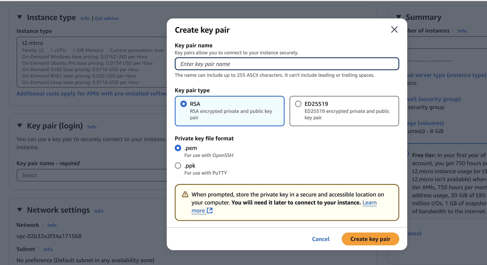
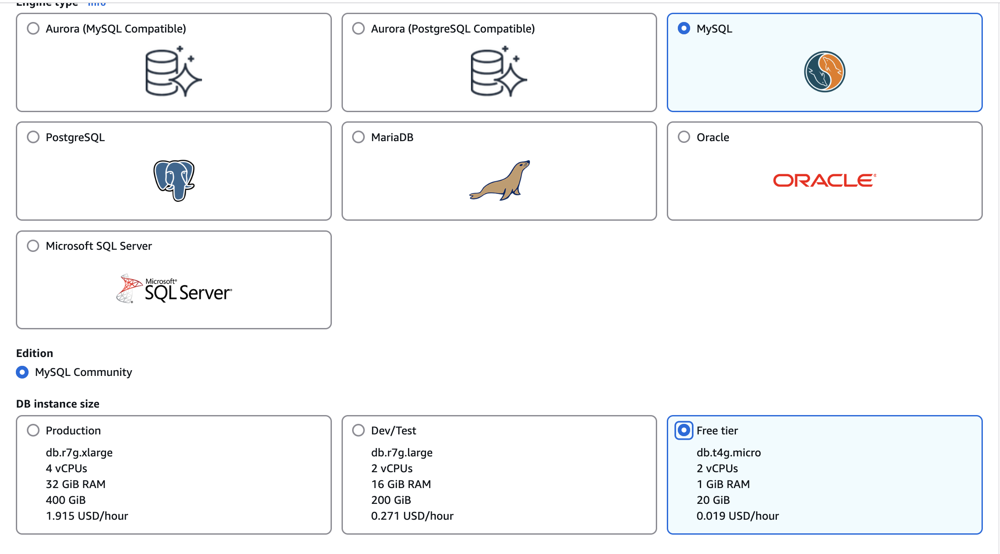
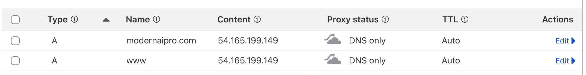

# Launching your product on AWS

1. [Sign up for AWS](https://aws.amazon.com/free/)

2. [Set Up AWS EC2 Instance](https://us-east-1.console.aws.amazon.com/ec2/home?region=us-east-1)
   - Choose 2 t2.micro instances [one for frontend and one for backend]

3. Create a new RSA key pair in .pem format
   
   - Generate an RSA key pair in .pem format during setup Cloud
   - Configure the security group to allow inbound traffic on ports:
     - 22 (SSH)
     - 80 (HTTP) 
     - 443 (HTTPS)
     - 3000/8000 (development ports)

4. Create an RDS instance with Easy Create option [choose MySQL] and connect it to EC2 instance.
   

5. Connect to your server:

   ```bash
   # Set permissions on key file
   chmod 400 ~/Downloads/vibe-coding.pem
   
   # SSH into server
   ssh -i ~/Downloads/vibe-coding.pem ec2-user@backend-ip-address
   
   # Update system packages
   sudo yum update -y
   
   # Install required packages
   sudo yum install -y git python3 python3-pip nodejs npm
   
   # Set up permissions
   sudo chmod o+x /home/ec2-user

   # Install Poetry
   curl -sSL https://install.python-poetry.org | python3 -
   export PATH="$HOME/.local/bin:$PATH"
   ```

   If you need Python 3.11:
   ```bash
   sudo yum install -y gcc openssl-devel bzip2-devel libffi-devel
   wget https://www.python.org/ftp/python/3.11.8/Python-3.11.8.tgz
   tar xzf Python-3.11.8.tgz
   cd Python-3.11.8
   ./configure --enable-optimizations
   sudo make altinstall
   ```

6. Clone the project:
   ```bash
   # Go to home directory
   cd ~
   git clone https://github.com/vibe-coding/my-super-app.git
   cd my-super-app
   ```

7. Install backend dependencies:
   ```bash
   cd backend
   python3 -m venv venv
   source venv/bin/activate
   poetry install
   poetry env activate

   ```

8. Start FastAPI:
   ```bash
   cd app
   poetry run uvicorn main:app --host 0.0.0.0 --port 8000
   ```

9. In another terminal, start the frontend:
   ```bash
   ssh -i ~/Downloads/vibe-coding.pem ec2-user@backend-ip-address
   cd frontend
   npm install
   sudo npm install -g serve
   
   # Test backend
   curl http://localhost:8000/

   # Test if frontend has build:
   ls -la /home/ec2-user/template_fullstack/frontend/build
   sudo chmod -R 755 /home/ec2-user/template_fullstack/frontend/build

  Buy the domain name from Namecheap or Cloudflare
    

  Create .env in frontend:
  REACT_APP_API_URL=https://modernaipro.com   
   
   # Start frontend
   serve -s build
   ```

10. Setup the Web server security:
    ```bash
    sudo yum install nginx
    sudo yum install certbot python3-certbot-nginx
    sudo ls /etc/nginx/sites-available/


    ```

11. Head to cloudflare and buy a domain name and setup its DNS.
    

12. Head back to your ec2 instance.

    ```bash 
    sudo certbot --nginx -d modernaipro.com -d www.modernaipro.com
    ```
 Accept the conditions.

sudo nano /etc/nginx/conf.d/modernaipro.com.conf

server {
    listen 80;
    listen [::]:80;
    
    server_name modernaipro.com www.modernaipro.com;
    
    # Redirect HTTP to HTTPS
    location / {
        return 301 https://$host$request_uri;
    }
}

server {
    listen 443 ssl;
    listen [::]:443 ssl;
    
    server_name modernaipro.com www.modernaipro.com;
    
    # SSL certificate configuration
    ssl_certificate /etc/letsencrypt/live/modernaipro.com/fullchain.pem;
    ssl_certificate_key /etc/letsencrypt/live/modernaipro.com/privkey.pem;
    
    # SSL settings (recommended for security)
    ssl_protocols TLSv1.2 TLSv1.3;
    ssl_prefer_server_ciphers on;
    ssl_ciphers ECDHE-ECDSA-AES128-GCM-SHA256:ECDHE-RSA-AES128-GCM-SHA256:ECDHE-ECDSA-AES256-GCM-SHA384:ECDHE-RSA-AES256-GCM-SHA384:ECDHE-ECDSA-CHACHA20-POLY1305:ECDHE-RSA-CHACHA20-POLY1305:DHE-RSA-AES128-GCM-SHA256:DHE-RSA-AES256-GCM-SHA384;
    
    # React app root directory
    root /home/ec2-user/template_fullstack/frontend/build;
    
    # React routing - serve index.html for all routes
    location / {
        try_files $uri $uri/ /index.html;
    }
    
    # FastAPI backend
    location /api {
        proxy_pass http://localhost:8000/api;
        proxy_set_header Host $host;
        proxy_set_header X-Real-IP $remote_addr;
        proxy_set_header X-Forwarded-For $proxy_add_x_forwarded_for;
        proxy_set_header X-Forwarded-Proto $scheme;
    }
    
    # Static files caching
    location ~* \.(js|css|png|jpg|jpeg|gif|ico|svg)$ {
        expires 30d;
        add_header Cache-Control "public, no-transform";
    }
    
    # Security headers
    add_header X-Content-Type-Options nosniff;
    add_header X-Frame-Options SAMEORIGIN;
    add_header X-XSS-Protection "1; mode=block";
}


13. Test if it is working: sudo nginx -t
sudo systemctl restart nginx

curl -k https://modernaipro.com/api/lessons


